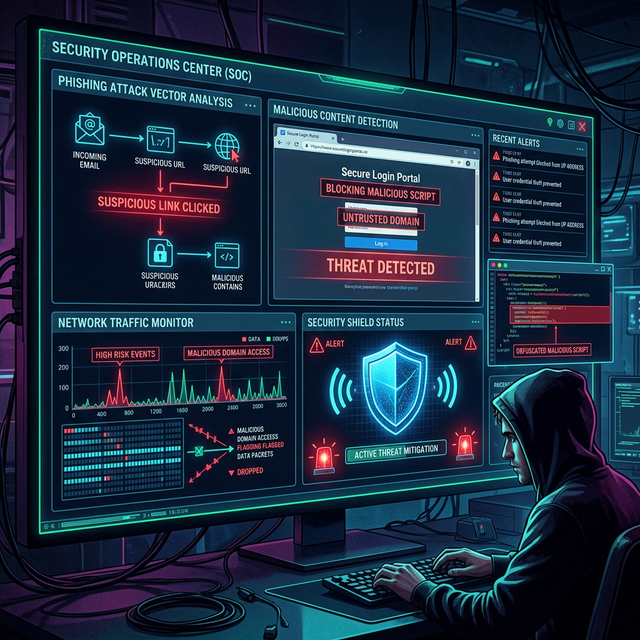
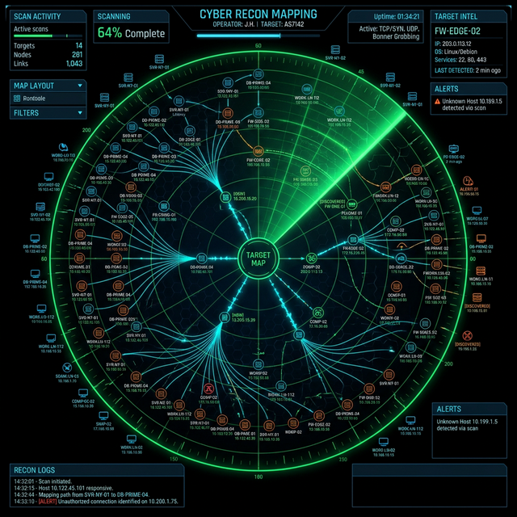

<!-- 
  =============================================================================
  PROJECT: SENIOR SECURITY ARCHITECT & LEAD ETHICAL HACKER PORTFOLIO
  OPERATOR: KALEESWARAN S
  VERSION: EXECUTIVE_3.0 (SWOT-ALIGNED / OPS-READY)
  =============================================================================
-->

  

  <b>Advanced Defensive Engineering × Controlled Offensive Exploitation</b>

  
  
  
  

---

## 🌐 EXECUTIVE_SUMMARY (SWOT_METHODOLOGY)

As a **Senior Cybersecurity Professional**, I architect high-assurance security frameworks using a robust **SWOT-driven methodology**. By analyzing organizational **Strengths** in existing infrastructure, I identify and remediate latent **Weaknesses** (technical and procedural). I proactively hunt for emerging **Threats**—including Zero-Day exploits and APT lifecycles—to create strategic **Opportunities** for defensive engineering, automated response, and enterprise-wide resilience.

My mission is to transform complex security telemetry into tactical intelligence, ensuring a zero-trust posture across hybrid-cloud infrastructures.

---

## ⚡ CORE_COMPETENCIES

<table align="center" border="0">
  <tr>
    <td width="33.33%" align="center">
       
      <b>Ethical Hacker</b> 
      <i>Red-team strategies & stealth exploitation.</i>
    </td>
    <td width="33.33%" align="center">
       
      <b>Lead Pentester</b> 
      <i>Advanced infrastructure & cloud assessments.</i>
    </td>
    <td width="33.33%" align="center">
       
      <b>SOC Architect</b> 
      <i>Engineering SIEM pipelines & log correlation.</i>
    </td>
  </tr>
  <tr>
    <td width="33.33%" align="center">
       
      <b>Network Defense</b> 
      <i>Hardening protocols & deep-packet forensics.</i>
    </td>
    <td width="33.33%" align="center">
       
      <b>AppSec Engineer</b> 
      <i>Full-stack vulnerability research & DevSecOps.</i>
    </td>
    <td width="33.33%" align="center">
       
      <b>Automation Lead</b> 
      <i>Security tools development & CI/CD hardening.</i>
    </td>
  </tr>
</table>

---

## 🛠️ TECHNICAL_ARSENAL

### 🔍 Cybersecurity Stack (Intermediate to Senior)

  
  
  
  
  
  
  
  
  
  
  
  
  
  
  
  

### 🌐 Network Infrastructure & Architecture

  
  
  
  
  
  
  
  

### 💻 Automation, Scripting & Engineering

  
  
  
  
  
  
  
  
  

---

## 🔬 SENIOR_SECURITY_PROJECTS_&_LABS

<table align="center">
  <tr>
    <td width="50%">
      <h3 align="center">🔐 Authify: Secure Identity Gateway</h3>
      

      
<b>Objective:</b> Resilient identity microservice providing secure authentication and token management. <b>Concept:</b> IAM, JWT Security, Bcrypt. <b>Tech:</b> Spring Boot, PostgreSQL, JWT.

      
<b>[Repository](https://github.com/KALEESWARANS-CYBER00/Authify)</b>

    </td>
    <td width="50%">
      <h3 align="center">🖱️ ClickTrap: Defensive Awareness Simulation</h3>
      

      
<b>Objective:</b> Phishing simulation tool educating users on deceptive UI patterns and social engineering vectors. <b>Concept:</b> Human Element Security. <b>Tech:</b> HTML5, CSS3, JavaScript.

      
<b>[Repository](https://github.com/KALEESWARANS-CYBER00/clicktrap)</b>

    </td>
  </tr>
  <tr>
    <td width="50%">
      <h3 align="center">🐍 SQLi-Report: Automated Vuln Analysis</h3>
      

      
<b>Objective:</b> Automated scanner for identifying complex SQL injection vectors in web endpoints. <b>Concept:</b> Automated Vulnerability Research (OWASP). <b>Tech:</b> Python, Regex, JSON.

      
<b>[Repository](https://github.com/KALEESWARANS-CYBER00/SQLi-Report)</b>

    </td>
    <td width="50%">
      <h3 align="center">📡 ReconMap: Attack Surface Discovery</h3>
      

      
<b>Objective:</b> Automated mapping of organizational attack surfaces and subdomain enumeration. <b>Concept:</b> OSINT & Recon Automation. <b>Tech:</b> Python, Nmap API, Fingerprinting.

      
<b>[Repository](https://github.com/KALEESWARANS-CYBER00/ReconMap)</b>

    </td>
  </tr>
  <tr>
    <td width="50%">
      <h3 align="center">🛠️ Kali-CLI: Advanced Tool Integration</h3>
      

      
<b>Objective:</b> Expansion module for Kali Linux to optimize professional penetration testing workflows. <b>Concept:</b> Pentesting Utility Engineering. <b>Tech:</b> Bash, Python, Kali OS.

      
<b>[Repository](https://github.com/KALEESWARANS-CYBER00/kali-cli)</b>

    </td>
    <td width="50%">
      <h3 align="center">🌐 DNS Investigation & Security Lab</h3>
      

      
<b>Objective:</b> Research environment for simulating and defending against DNS protocol threats. <b>Concept:</b> Infrastructure Security & Hardening. <b>Tech:</b> BIND9, Wireshark, Linux.

      
<b>[Repository](https://github.com/KALEESWARANS-CYBER00/dns-lab)</b>

    </td>
  </tr>
  <tr>
    <td width="50%">
      <h3 align="center">🚀 Redeploy: Secure Pipeline Orchestration</h3>
      

      
<b>Objective:</b> Automated deployment and rollback engine for secure code lifecycle management. <b>Concept:</b> DevSecOps & CI/CD Security. <b>Tech:</b> Bash, Git, Orchestration.

      
<b>[Repository](https://github.com/KALEESWARANS-CYBER00/Redeploy)</b>

    </td>
    <td width="50%">
      <h3 align="center">💬 ChatNet: Secure Socket Architecture</h3>
      

      
<b>Objective:</b> Prototype for peer-to-peer encrypted communication using low-level sockets. <b>Concept:</b> Network Security & Data Encryption. <b>Tech:</b> Java, Sockets, TLS.

      
<b>[Repository](https://github.com/KALEESWARANS-CYBER00/chatnet)</b>

    </td>
  </tr>
  <tr>
    <td width="50%">
      <h3 align="center">🤖 Chatbot: SEC-Ops Automation Engine</h3>
      

      
<b>Objective:</b> AI-driven bot for streamlining security incident response and task automation. <b>Concept:</b> Operational Intelligence. <b>Tech:</b> Python, NLP, Automation APIs.

      
<b>[Repository](https://github.com/KALEESWARANS-CYBER00/chatbot)</b>

    </td>
    <td width="50%">
      <h3 align="center">🔑 Chmod-Tool: Linux Permission Hardening</h3>
      

      
<b>Objective:</b> Utility for granular management of Unix permissions to prevent privilege escalation. <b>Concept:</b> Access Control Hardening. <b>Tech:</b> C, Bash, Linux Kernel.

      
<b>[Repository](https://github.com/KALEESWARANS-CYBER00/chmod-tool)</b>

    </td>
  </tr>
  <tr>
    <td width="50%">
      <h3 align="center">📈 ProfitPulse: Financial Integrity Analytics</h3>
      

      
<b>Objective:</b> Analytical dashboard focusing on data integrity and secure financial reporting. <b>Concept:</b> Secure Business Intelligence. <b>Tech:</b> Python, SQL, Matplotlib.

      
<b>[Repository](https://github.com/KALEESWARANS-CYBER00/ProfitPulse)</b>

    </td>
    <td width="50%">
      <h3 align="center">📝 FormEZ: Hardened Input Framework</h3>
      

      
<b>Objective:</b> Security-first web form handler designed to mitigate XSS and injection vulnerabilities. <b>Concept:</b> Web Application Hardening. <b>Tech:</b> PHP, HTML5, Web UI.

      
<b>[Repository](https://github.com/KALEESWARANS-CYBER00/FormEZ)</b>

    </td>
  </tr>
  <tr>
    <td width="50%">
      <h3 align="center">🧮 WebCalculator: Secure Coding Validation</h3>
      

      
<b>Objective:</b> Utility demonstrating client-side logic hardening and mathematical security principles. <b>Concept:</b> Operational Logic Integrity. <b>Tech:</b> JavaScript, Tailwind CSS.

      
<b>[Repository](https://github.com/KALEESWARANS-CYBER00/WebCalculator)</b>

    </td>
    <td width="50%">
      <h3 align="center">♻️ Waste Management: Secure Logistics System</h3>
      

      
<b>Objective:</b> Resource management system with role-based access control and data integrity audits. <b>Concept:</b> System Logic & RBAC. <b>Tech:</b> Java, MySQL, Spring Framework.

      
<b>[Repository](https://github.com/KALEESWARANS-CYBER00/Waste-Management)</b>

    </td>
  </tr>
</table>

---

## 🏆 PROFESSIONAL_PORTFOLIO_DASHBOARD

<table align="center">
  <tr>
    <th colspan="3">🏹 CYBERSECURITY_DOMINANCE_PLATFORMS</th>
  </tr>
  <tr>
    <td align="center">
      <a href="https://tryhackme.com/p/kalees">
         
        
      </a>
    </td>
    <td align="center">
      <a href="https://app.hackthebox.com/profile/123456">
         
        
      </a>
    </td>
    <td align="center">
      <a href="https://cyberdefenders.org/p/skaleeswaran00">
         
        
      </a>
    </td>
  </tr>
  <tr>
    <td align="center">
      
    </td>
    <td align="center">
      
    </td>
    <td align="center">
      
    </td>
  </tr>
  <tr>
    <td align="center">
      
    </td>
    <td align="center">
      
    </td>
    <td align="center">
      
    </td>
  </tr>
</table>

---

## 🎯 MISSION_CRITICAL_STRATEGY (SENIOR_FOCUS)
- 🔭 **Advanced Pentesting:** Master-level pivoting, Active Directory exploitation, and Kerberos manipulation.
- 🛠️ **DevSecOps Architecture:** Building automated vulnerability scanners using Python and container-security APIs.
- 📡 **Hardening:** Implementation of Zero-Trust Network Access (ZTNA) and BGP Secure-Routing.
- 🧠 **Forensics:** Advanced memory and disk forensic analysis targeting stealth malware persistence.

---

## 📊 LIVE_INTELLIGENCE_ANALYTICS

<table>
<tr>
<td align="center" width="50%">

### ⚡ AGGREGATED SECURITY STATS

</td>

<td align="center" width="50%">

### 🏹 CONTRIBUTION PERSISTENCE

</td>
</tr>
</table>

 

### 🧠 LANGUAGE PROFICIENCY MAP

---

## 📡 ESTABLISH_CRITICAL_COMMUNICATION

  
  
  

**END_OF_TRANSMISSION**

