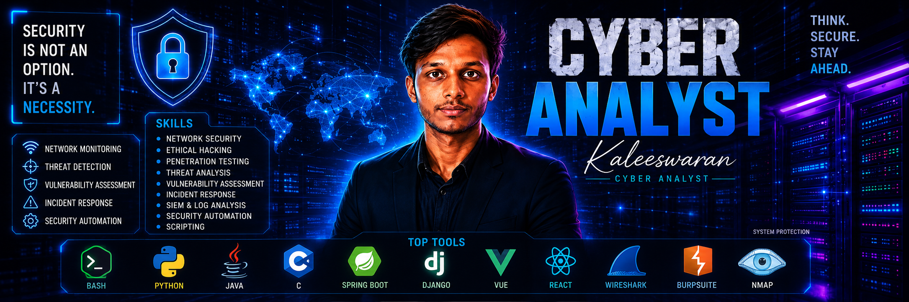

<!-- BANNER IMAGE -->

  

<!-- HERO SECTION -->

 
  # Kaleeswaran S
  ### **Ethical Hacker • Penetration Tester • Full-Stack Developer • Security Researcher**

  

    <em>"Building secure systems through offensive security and software engineering."</em>
  

  <!-- ONE TYPING ANIMATION ONLY -->
  

    

  

    
    &nbsp;
    
  

---

## 👨‍💻 ABOUT ME

I am an **Ethical Hacker**, **Penetration Tester**, and **Full-Stack Developer** focused on discovering vulnerabilities and engineering secure systems. By combining offensive penetration testing techniques with full-stack software development, I build tools and architectures that withstand real-world attacks.

- **Specialization:** Web application penetration testing, security automation, API security, and Active Directory attack paths.
- **Currently Learning:** Cloud security architecture (AWS/Azure) and advanced adversary emulation techniques.
- **Long-Term Goal:** To become a lead Application Security Engineer / Red Team Specialist, developing enterprise-grade security tools and conducting high-impact vulnerability research.

---

## 🛠️ CORE EXPERTISE

| Area | Skills | Tools |
| :--- | :--- | :--- |
| **Web Security** | OWASP Top 10, REST/GraphQL API testing, Auth Bypass | Burp Suite Pro, FFUF, OWASP ZAP, Postman |
| **Penetration Testing** | Vulnerability scanning, Manual exploitation, PrivEsc | Nmap, Metasploit, LinPEAS, WinPEAS |
| **Security Automation** | Asynchronous fuzzing, Recon pipelines, Log parsing | Python (Asyncio), Bash, Go, Docker |
| **Active Directory** | Kerberoasting, DCSync, Domain Escalation, GPO abuse | BloodHound, Mimikatz, Impacket, Rubeus |
| **Full-Stack Development**| Secure REST APIs, Responsive UI, DB design | Next.js, React, Node.js, TypeScript, PostgreSQL |
| **Cloud Security** | CSPM basics, IAM policy auditing, Container security | AWS, Azure, Docker, Terraform |

---

## 🏆 FEATURED PROJECTS

### 1. `security-automation` — PentestFlow Recon Command Center
- **One-line Description:** An event-driven security orchestration dashboard for automated attack surface reconnaissance.
- **Problem Solved:** Replaces slow manual reconnaissance across multi-domain target scopes with automated asset indexing.
- **Technologies Used:** Python (Asyncio), Go, TypeScript, Next.js, Spring Boot, WebSockets, Docker.
- **Key Results:** Reduced initial target discovery time by 75% while cataloging 5,000+ domain assets automatically.
- **Repository Link:** [https://github.com/KALEESWARANS-CYBER00/security-automation](https://github.com/KALEESWARANS-CYBER00/security-automation)

---

### 2. `web-security-toolkit` — VulnRadar API Vulnerability Scanner
- **One-line Description:** A modular Python vulnerability assessment engine tailored for REST and GraphQL APIs.
- **Problem Solved:** Minimizes false positives from generic commercial scanners by applying AST code analysis and custom payload suites.
- **Technologies Used:** Python, Burp Suite API, Docker, PostgreSQL, React, OpenAPI Specs.
- **Key Results:** Identified SQLi, Stored XSS, and BOLA flaws across 20+ staging environments with under 3% false positives.
- **Repository Link:** [https://github.com/KALEESWARANS-CYBER00/web-security-toolkit](https://github.com/KALEESWARANS-CYBER00/web-security-toolkit)

---

### 3. `red-team-labs` — Active Directory Adversary Emulation Lab
- **One-line Description:** An IaC automated enterprise network environment for simulating Windows Active Directory attack chains.
- **Problem Solved:** Provides a safe, multi-domain lab to test Kerberos attacks, GPO abuse, and SIEM detection rules.
- **Technologies Used:** Windows Server 2022, Terraform, BloodHound, Mimikatz, Impacket, Security Onion.
- **Key Results:** Documented domain escalation paths from standard domain user to Domain Admin with associated SIEM detection signatures.
- **Repository Link:** [https://github.com/KALEESWARANS-CYBER00/red-team-labs](https://github.com/KALEESWARANS-CYBER00/red-team-labs)

---

### 4. `secure-auth-api` — Zero-Trust Identity Gateway
- **One-line Description:** A standalone microservice authentication gateway incorporating zero-trust access control.
- **Problem Solved:** Defends authentication endpoints against token replay, algorithm switching, and credential stuffing attacks.
- **Technologies Used:** Node.js, TypeScript, Redis, PostgreSQL, Docker, Jest, OAuth 2.0 / OIDC.
- **Key Results:** Delivered sub-15ms authentication latency while enforcing RS256 token rotation and Redis session revocation.
- **Repository Link:** [https://github.com/KALEESWARANS-CYBER00/secure-auth-api](https://github.com/KALEESWARANS-CYBER00/secure-auth-api)

---

### 5. `ctf-writeups` — CTF Solutions & Exploitation Notes
- **One-line Description:** Structured vulnerability write-ups and technical walkthroughs for CTF machines.
- **Problem Solved:** Documents reproducible exploit chains and mitigation strategies for learning and audit references.
- **Technologies Used:** Markdown, Python, Burp Suite, Ghidra, GDB, PwnTools.
- **Key Results:** Published 50+ challenge write-ups detailing Linux/Windows privilege escalation and web vulnerabilities.
- **Repository Link:** [https://github.com/KALEESWARANS-CYBER00/ctf-writeups](https://github.com/KALEESWARANS-CYBER00/ctf-writeups)

---

### 6. `cyber-portfolio` — Cybersecurity Portfolio Website
- **One-line Description:** An interactive dark-themed web portfolio showcasing projects and security metrics.
- **Problem Solved:** Offers hiring managers an interactive visual platform to review projects, code, and live metrics.
- **Technologies Used:** React, Next.js, TypeScript, TailwindCSS, Vercel.
- **Key Results:** Achieved 100/100 Lighthouse performance scores and dynamic project rendering.
- **Repository Link:** [https://github.com/KALEESWARANS-CYBER00/cyber-portfolio](https://github.com/KALEESWARANS-CYBER00/cyber-portfolio)

---

## 🧪 LABS & CTF

| Platform / Lab | Skills Learned | Tools Used | Documentation Link |
| :--- | :--- | :--- | :--- |
| **Hack The Box** | Web exploitation, Linux & Windows PrivEsc, Buffer Overflows | Burp Suite, Nmap, Metasploit, GDB | [HTB Notes](https://github.com/KALEESWARANS-CYBER00/ctf-writeups) |
| **TryHackMe** | Offensive security paths, Network pentesting, Cyber defense | Wireshark, Gobuster, FFUF, Hydra | [THM Notes](https://github.com/KALEESWARANS-CYBER00/ctf-writeups) |
| **PicoCTF** | Cryptography analysis, Forensics, Reverse engineering | Ghidra, CyberChef, PwnTools | [PicoCTF Writeups](https://github.com/KALEESWARANS-CYBER00/ctf-writeups) |
| **Home Labs** | SIEM log analysis, Enterprise SOC simulation, Firewalls | Security Onion, PfSense, Proxmox | [Home Lab Docs](https://github.com/KALEESWARANS-CYBER00/red-team-labs) |
| **Active Directory Labs** | Kerberoasting, DCSync, Trust exploitation, BloodHound mapping | BloodHound, Mimikatz, Rubeus | [AD Lab Docs](https://github.com/KALEESWARANS-CYBER00/red-team-labs) |

---

## 💻 TECH STACK

<table width="100%">
  <tr>
    <td width="25%"><strong>Programming</strong></td>
    <td></td>
  </tr>
  <tr>
    <td><strong>Security Tools</strong></td>
    <td></td>
  </tr>
  <tr>
    <td><strong>Frameworks</strong></td>
    <td></td>
  </tr>
  <tr>
    <td><strong>Databases</strong></td>
    <td></td>
  </tr>
  <tr>
    <td><strong>DevOps</strong></td>
    <td></td>
  </tr>
  <tr>
    <td><strong>Operating Systems</strong></td>
    <td></td>
  </tr>
</table>

---

## 📊 GITHUB STATS

  
  &nbsp;
  

  

---

## 📜 ACHIEVEMENTS & MILESTONES

- 🛠️ **[X]+ Security & Software Projects** built and open-sourced.
- 🧪 **[Y]+ Enterprise Security Labs** deployed and documented.
- 📖 **[Z]+ CTF Machine Write-ups** published.
- 📜 **Security Certifications:** eJPT (Junior Penetration Tester), Security+ in preparation.
- 🤝 **Open-Source Contributions:** Active maintainer of cybersecurity tools and automation scripts.

---

## 🎯 CURRENT FOCUS

- ☁️ **Learning Cloud Security:** AWS & Azure security posture management and IAM policy auditing.
- ⚙️ **Building Security Tools:** Developing custom Python and Go network recon tools.
- 🏰 **Practicing Active Directory:** Practicing advanced domain trust escalation attack chains.
- 🚩 **Solving CTFs:** Consistently solving web and privilege escalation challenges on Hack The Box and TryHackMe.

---

## 🤝 CONNECT

  
  &nbsp;&nbsp;
  
  &nbsp;&nbsp;
  
  &nbsp;&nbsp;
  

---

  Designed & Developed by <b>Kaleeswaran S</b> (@KALEESWARANS-CYBER00)

